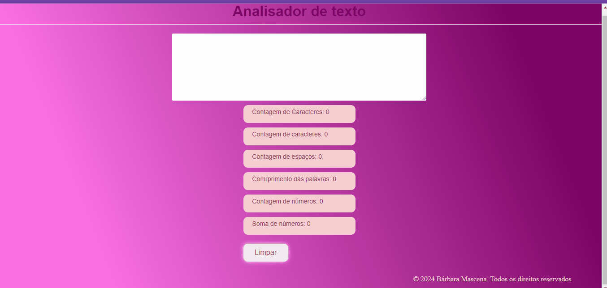

# Analisador de Texto

## Índice

- [1. Considerações gerais](#1-considerações-gerais)
- [2. Resumo do projeto](#2-resumo-do-projeto)
- [3. Funcionalidades](#3-funcionalidades)
- [4. Boilerplate](#4-boilerplate)
- [5. Critérios de aceitação mínimos do projeto](#5-critérios-de-aceitação-mínimos-do-projeto)
- [6. Testes](#6-testes)

---

## 1. Considerações gerais

 O Analisador de Texto foi um projeto individual desenvolvido com metodologia ágil, focando nas linguagens JavaScript, HTML e CSS para a certificação como Desenvolvedor Front End. Dividido em cinco sprints, abordou aspectos específicos do desenvolvimento e proporcionou uma experiência transformadora em life skills.
 As sprints envolveram apresentações, estruturação do bootcamp, estudo e programação de HTML/CSS, estilização da aplicação com melhores práticas de CSS, e aprofundamento no JavaScript, abordando conceitos como manipulação do DOM, eventos e mais.
 Os resultados estão disponíveis no Git Pages, representando uma conquista significativa e uma valiosa adição ao portfólio, destacando habilidades desde a concepção até a implementação como Desenvolvedor Front End.

## 3. Resumo do projeto

O Analisador de Texto é uma ferramenta online que possibilita aos usuários extrair informações relevantes de um texto, oferecendo funcionalidades como contagem de palavras, soma de números e identificação e contagem de números. Essas aplicações são valiosas para uma compreensão mais aprofundada de textos, auxiliando em processos de tomada de decisões.

## 4. Funcionalidades

A lista de recursos inclui:

1. **Inserção de Texto:** Os usuários podem digitar um texto em uma caixa designada.
2. **Contagem de Palavras:**  Exibe em tempo real o número de palavras no texto inserido.
3. **Contagem de Caracteres:**  Atualiza instantaneamente o total de caracteres, incluindo espaços e pontuações.
4. **Contagem de Caracteres (sem espaços e pontuações):** Realiza a contagem de caracteres, excluindo espaços e pontuações, apresentando o resultado em tempo real.
5. **Contagem de Números:** Identifica e exibe a quantidade de números presentes no texto.
6. **Soma dos Números:** Efetua a soma de todos os números no texto, apresentando o resultado de forma imediata.
7. **Comprimento Médio das Palavras:** Calcula e mostra o comprimento médio das palavras no texto inserido.
8. **Limpeza de Conteúdo:** Oferece a opção de limpar o conteúdo da caixa de texto por meio de um botão.

## 5. Boilerplate

A lógica do projeto deve ser completamente renovada em JavaScript. Neste projeto, NÃO foi permitido usar bibliotecas ou frameworks, apenas JavaScript puro, também conhecido como Vanilla JavaScript.

O *padrão* que fornece contém a seguinte estrutura:

    ./
    ├── .babelrc
    ├── .editorconfig
    ├── .eslintrc
    ├── .gitignore
    ├── README.md
    ├── package.json
    ├── src
    │   ├── analyzer.js
    │   ├── index.html
    │   ├── index.js
    │   └── style.css
    └── test
        ├── .eslintrc
        └── analyzer.spec.js

### Descrição de scripts / arquivos

- `README.md`:  O readme foi elaborado com as informações necessárias para o uso da aplicação web suas funcionalidades e decisões de desingn
você deve modificá-lo para explicar as informações necessárias para
 
- `.github/workflows`: esta pasta contém a configuração para
a execução do Github Actions.
  
- `read-only/`: esta pasta contém os testes dos critérios mínimos de aceitação
e end-to-end. 
- [`src/index.html`](./src/index.html): este é o ponto de entrada da aplicação.
  contem o HTML.
- [`src/style.css`](./src/style.css): Esta pasta contem regras de estilo e nao foi utilizado fremewoeks.
- [`src/analyzer.js`](./src/analyzer.js): aqui foi implementado
o objeto `analyzer`, já _exportado_ no _boilerplate_.
Este objeto (`analyzer`) que continha seis métodos:

  + `analyzer.getWordCount(text)`: esta função retornou  a contagem de
  palavras que estão no parâmetro `text` do tipo `string`.
  + `analyzer.getCharacterCount(text)`:  esta função retornou  a
  contagem de caracteres que estão no parâmetro `text` do tipo `string`.
  + `analyzer.getCharacterCountExcludingSpaces(text)`:  esta função retornou  a contagem de caracteres excluindo espaços e sinais de pontuação
  que estão no parâmetro `text` do tipo `string`.
  + `analyzer.getNumberCount(text)`:  esta função retornou  quantos
  números estão no parâmetro `text` do tipo `string`.
  + `analyzer.getNumberSum(text)`: esta função retornou  a soma de todos os
  números que estão no parâmetro `text` do tipo `string`.
  + `analyzer.getAverageWordLength(text)`:  esta função retornou  o
  comprimento médio das palavras que estão no parâmetro `text` do tipo
  `string`. Usei 2 casas decimais.

- [`src/index.js`](./src/index.js): Ouvir eventos do DOM,
invoquei os métodos do objeto `analyzer` conforme necessário e atualizar
o resultado na IU (interface de usuária).
- [`test/analyzer.spec.js`](./test/analyzer.spec.js): este arquivo contém os
testes unitários para os métodos do objeto `analyzer`.

---

#### Deploy

Fez com que o site fosse publicado (ou _deployed_) para que as usuárias da
web possam acessá-los é algo comum em projetos de desenvolvimento de software.

Neste projeto, usei o _Github Pages_ para implantar nosso site.

Foi feito o comando `npm run deploy`
para gerar o link para consultar a [documentação oficial](https://bmascena.github.io/SAP012-text-analyzer/).

## 6. Critérios de Aceitação Mínimos do Projeto

A seguir, você encontrará os critérios de aceitação mínimos do projeto
relacionados a cada objetivo de aprendizado.

### HTML

- **Uso de HTML semântico**

A semântica HTML é algo que eu utilizo para marcar o conteúdo das minhas páginas da web de uma maneira mais significativa e descritiva. Essa abordagem melhorou a estrutura e a compreensão do meu código, tornando-o mais fácil de entender tanto para mim quanto para máquinas. Os benefícios que você pode usar semântica HTML incluem: 1. **Melhoria na Acessibilidade:** Utilizando tags semânticas, consigo criar uma estrutura de página mais clara, facilitando a navegação para pessoas com deficiências visuais que carecem de leitores de tela.

### CSS

- **Uso de seletores CSS**

Utilizei os seletores de CSS para direcionar e estilizar os elementos HTML em minhas páginas da web. Eles são uma parte essencial das regras de estilo em Cascading Style Sheets (CSS), permitindo que eu especifique quais elementos ou conjuntos de elementos devem receber determinados estilos visuais. Aqui estão algumas das principais funções dos seletores CSS: 1. **Identificação de Elementos:** Utilizo os seletores para identificar e selecionar elementos específicos em meu documento HTML, permitindo que eu aplique estilos apenas às partes específicas da página. 

- **Modelo de caixa (box model): borda, margem, preenchimento**

Usei os modelos de caixa no CSS como ferramentas essenciais para controlar a apresentação e o layout dos elementos HTML nas minhas páginas da web. Cada elemento era considerado como uma caixa retangular, e o modelo de caixa definia como o conteúdo, as bordas, o preenchimento e as margens desses elementos eram organizados. Esses modelos de caixa eram particularmente úteis para mim em várias situações: 1. **Dimensionamento e Layout:** Permitiam determinar o tamanho total de um elemento, considerando o conteúdo, as bordas, o preenchimento e as margens.

### Web APIs

- **Uso de seletores do DOM**

Utilizei os seletores de DOM como mecanismos para selecionar e interagir com elementos HTML ou XML em uma página web. Eles são amplamente utilizados para manipular dinamicamente o conteúdo, estrutura e estilo de uma página.

  + [ ] usei:
        [`seletor do DOM querySelector`](https://developer.mozilla.org/pt-BR/docs/Web/API/Document/querySelector).

  + [ ] usei:
        [`seletor do DOM getElementById`](https://developer.mozilla.org/pt-BR/docs/Web/API/Document/getElementById).

- **Manipulação de eventos do DOM (ouvintes, propagação, delegação)**

usei os manipuladores de eventos para obter respostas das ações dos usuários. Esses eventos podem ser cliques de mouse, pressionamentos de tecla, alterações em formulários, preenchimento de páginas, entre outros.

- Manipulação de eventos do DOM (ouvintes, propagação, delegação): `addEventListener`;

- Manipulação dinâmica do DOM:`textContent`.

### JavaScript

- Tipos de dados primitivos;

- Strings (cadeias de caracteres);

- Variáveis (declaração, atribuição, escopo);

- Uso de condicionais ;

- Uso de loops ;

- Funções (parâmetros, argumentos, retorno);

- Testes unitários (unit tests);

- Módulos do ECMAScript (ES Modules);

- Uso de linter (ESLINT);

- Uso de identificadores descritivos (Nomenclatura e Semântica).

### Controle de Versões (Git e GitHub)

- GitHub: Criação de conta e repositórios, configuração de chaves SSH;

- Git: Controle de versões com git (clone,status, add, commit, push, deploy);

- GitHub: A aplicação está implantada no GitHub Pages
  [Text Analyzer](https://bmascena.github.io/SAP012-text-analyzer/).

### Foco na Usuária

- **Projetar e desenvolver um produto ou serviço centrado nas usuárias**

### Design do Produto

- **Projetar em diferentes níveis de fidelidade**

  + [ ] A estudante criou protótipos de baixa fidelidade para a UI (interface gráfica).

- **Seguir os princípios básicos do design visual**

  + [ ] Foram consideradas as regras básicas de
        [design visual](https://coda.io/d/Bootcamp-UX-Contenido_dqkqk2rV9Z2/Reglas-basicas-de-diseno-visual_suVcO)
        para projetar a UI (interface gráfica).

## 7. Testes

O projeto conta com 3 conjuntos de testes que ajudaram a verificar se
os critérios mínimos de aceitação foram cumpridos.

### Testes Unitários

Um teste unitário é uma técnica de teste de software na qual se verifica
que cada componente individual de um programa ou sistema funcione corretamente
isoladamente. Em outras palavras, cada unidade de código é testada separadamente
para garantir que atenda aos requisitos e especificações.

Os testes unitários deste projeto executarão os métodos `getWordCount`,
`getCharacterCount`, `getCharacterCountExcludingSpaces`, `getNumbersCount`,
`getNumbersSum` e `getAverageWordLength` com diferentes argumentos e verificarão
se os valores retornados são os esperados.

### Testes de Critérios Mínimos de Aceitação

Os testes analisaram os arquivos
[`index.html`](src/index.html),
[`index.js`](src/index.html),
[`analyzer.js`](src/analyzer.js)
e
[`style.css`](src/style.css)
para verificar se cumpre os
[critérios mínimos de aceitação](#6-critérios-de-aceitação-mínimos-do-projeto).
Cada critério está relacionado a um objetivo de aprendizado.

também foram executados 
individualmente com os seguintes comandos:

- `npm run test:oas-html`
- `npm run test:oas-css`
- `npm run test:oas-web-api`
- `npm run test:oas-js`

#### Testes End-to-End

End-to-end (E2E) é uma técnica de teste de software na qual se verifica
o funcionamento de todo o sistema, do início ao fim. Em outras palavras, é testado
o fluxo completo do software, simulando a interação da usuária com a aplicação,
para garantir que todas as partes do sistema funcionem corretamente em conjunto.

### GitHub Actions

O repositório usa o GitHub Actions para executar automaticamente
os testes unitários, testes de critérios mínimos de aceitação e
testes end-to-end toda vez que você fizer um _push_ no ramo
_main_ do seu repositório.
